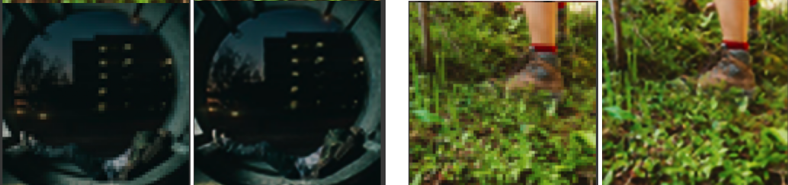
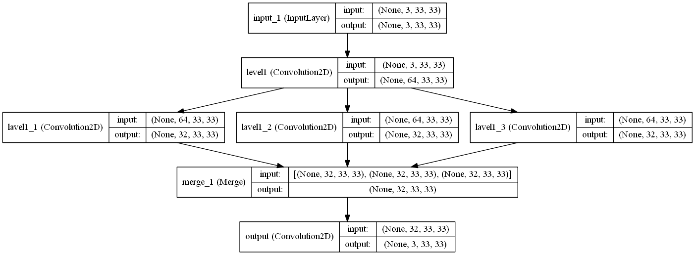
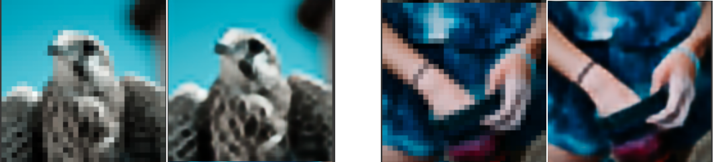
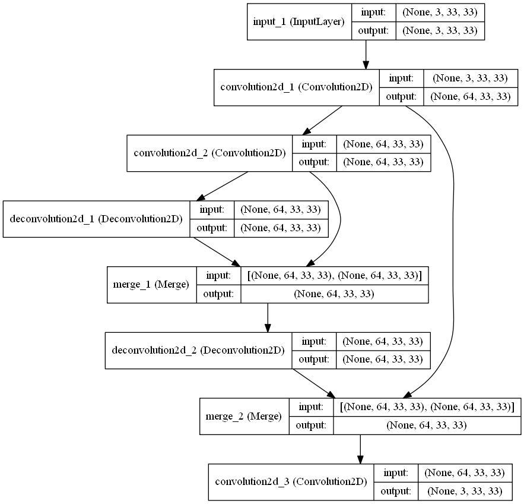

# SR-CNN
Super resolution based on SRCNN using Keras (2.0)

 
Please refer to paper for more details on working https://arxiv.org/pdf/1501.00092v3.pdf
   
<b>Install require dependency</b> 
pip install Pillow==2.2.2 
pip install tensorflow  

Image dataset was downloaded from google images, refer to link 
(https://www.pyimagesearch.com/2017/12/04/how-to-create-a-deep-learning-dataset-using-google-images/)  
Two architectures are implemented.  1. Expanded Super Resolution CNN (ESRCNN)  

This gave good results, 
 

 

 2. Denoiseing Super Resolution CNN (DSRCNN) 
This had better results than previous.
 

 
Both the model was trained on 2000 images for 500 epochs. In this notebook I have used 128x128 size images 

<b>Credits</b> 
Architecture details - https://github.com/olgaliak/
